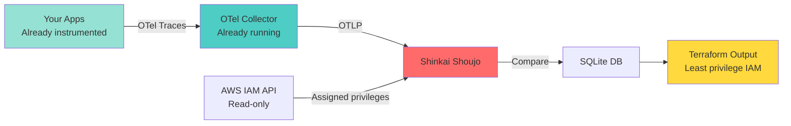
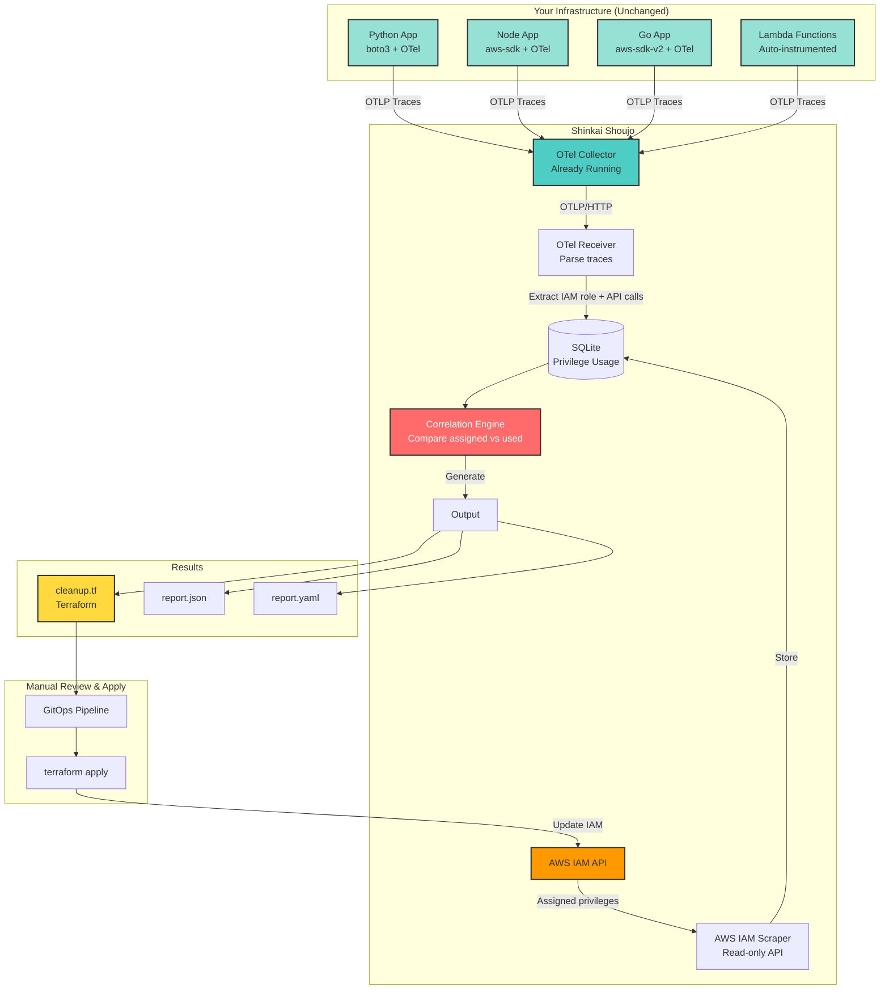

# Shinkai Shoujo (深海少女)
## Deep Sea Girl - Agentless AWS IAM Privilege Correlation

<div align="center">


*"Deep sea girl, pulled by her arm... The marine snow sings a song of blessing"*

**Stop guessing which IAM privileges you actually need.**

[Quick Start](#quick-start) • [How It Works](#how-it-works) • [Installation](#installation)
</div>

---

## The Problem

Your AWS IAM roles have **hundreds of permissions**.

But you only **use 10%** of them.

The other 90%? **Attack surface.**

```terraform
# What you have
resource "aws_iam_role_policy_attachment" "app" {
  role       = "MyAppRole"
  policy_arn = "arn:aws:iam::aws:policy/AmazonS3FullAccess"  # 🔴 WAY too much
}

# What you actually need
resource "aws_iam_policy" "app_minimal" {
  policy = jsonencode({
    Statement = [{
      Effect = "Allow"
      Action = [
        "s3:GetObject",      # ✅ Used 3,421 times
        "s3:PutObject"       # ✅ Used 234 times
      ]
      Resource = "arn:aws:s3:::my-bucket/*"
    }]
  })
}
```

**The difference?**
- Before: Attacker can delete your entire S3 account
- After: Attacker can only read/write one bucket

---

## The Solution

**Shinkai Shoujo** finds unused IAM privileges by analyzing your **existing OpenTelemetry traces**.

### Zero agents. Zero deployment. Just insights.

```bash
# 1. Point Shinkai at your OTel collector
$ shinkai-shoujo configure --otel-endpoint http://localhost:4318

# 2. Run weekly analysis
$ shinkai-shoujo analyze

# 3. Get Terraform to fix it
$ shinkai-shoujo generate terraform --output cleanup.tf

✨ Done. You now have least-privilege IAM.
```

---

## Philosophy

**The name comes from "Deep Sea Girl" (深海少女) for Hatsune Miku.**

A song about finding your true identity after losing it in the depths.

**Similarly, Shinkai Shoujo helps your infrastructure find its true identity:**
- Discovering what privileges are actually needed
- Removing what doesn't belong
- Revealing the minimal viable permission set

**Like marine snow falling through the ocean,** telemetry data quietly accumulates, revealing the truth beneath the surface.

---

## How It Works



### The Magic

**Your AWS SDKs already emit OpenTelemetry traces:**

```json
{
  "name": "S3.GetObject",
  "attributes": {
    "aws.service": "s3",
    "aws.operation": "GetObject",
    "aws.region": "us-east-1"
  },
  "resource": {
    "aws.iam.role": "arn:aws:iam::123:role/MyAppRole"
  }
}
```

**Shinkai Shoujo:**
1. Collects these traces (you're already sending them)
2. Queries AWS IAM for assigned privileges
3. Compares: `assigned - used = unused`
4. Generates Terraform to remove the unused ones

**No agents. No eBPF. No kernel access. Just data correlation.**

---

## Features

### ✨ Agentless
- Works with existing OTel infrastructure
- No deployment to production instances
- No kernel requirements
- No privileges beyond IAM read

### 🎯 Accurate
- Based on real API calls (not heuristics)
- Configurable observation window (default: 7 days)
- Handles scheduled jobs (monthly backups, quarterly reports)
- Excludes new roles until sufficient data collected

### 🛡️ Safe
- Read-only IAM access
- **Never** modifies IAM automatically
- Generates Terraform for manual review
- GitOps-friendly workflow

### 🚀 Fast
- Single Go binary
- SQLite storage (no database to manage)
- Weekly batch processing
- Sub-second queries

### 📊 Observable
- Prometheus metrics
- Structured logging
- Web UI for browsing results
- CLI for automation

---

## Quick Start

### Prerequisites

```bash
# 1. Your apps already export OTel traces (check this)
$ curl http://localhost:4318/v1/traces
# Should return 200 OK

# 2. You have AWS credentials with IAM read access
$ aws iam list-roles --max-items 1
# Should list a role
```

### Install

```bash
# Download latest release
$ curl -L https://github.com/0xKirisame/shinkai-shoujo/releases/latest/download/shinkai-shoujo-linux-amd64 -o shinkai-shoujo
$ chmod +x shinkai-shoujo
$ sudo mv shinkai-shoujo /usr/local/bin/

# Or build from source
$ git clone https://github.com/0xKirisame/shinkai-shoujo
$ cd shinkai-shoujo
$ go build -o shinkai-shoujo cmd/shinkai-shoujo/main.go
```

### Configure

```bash
# Create config
$ shinkai-shoujo init

# Edit config
$ cat > ~/.shinkai-shoujo/config.yaml << EOF
otel:
  endpoint: "http://localhost:4318"  # Your OTel collector
  
aws:
  region: "us-east-1"
  # Uses default credential chain (env vars, ~/.aws/credentials, IAM role)
  
observation:
  window_days: 7
  min_observation_days: 2  # Exclude roles newer than this
  
storage:
  path: "~/.shinkai-shoujo/shinkai.db"
EOF
```

### Run Analysis

```bash
# One-time analysis
$ shinkai-shoujo analyze

╔════════════════════════════════════════════════════════════════╗
║ Shinkai Shoujo - Analysis Complete                             ║
╚════════════════════════════════════════════════════════════════╝

📊 Summary (7-day observation window)

Total IAM Roles Analyzed: 47
  ├─ Over-privileged: 38 (81%)
  ├─ Properly scoped: 7 (15%)
  └─ Unused (no activity): 2 (4%)

Total Unused Privileges Found: 1,247
  ├─ HIGH RISK (Delete*/Terminate*): 23
  ├─ MEDIUM RISK (Create*/Modify*): 456
  └─ LOW RISK (Describe*/List*): 768

Potential Attack Surface Reduction: 68%

💾 Results saved to: /home/user/.shinkai-shoujo/reports/2025-02-16.json

Next steps:
  1. Review: shinkai-shoujo report --latest
  2. Generate Terraform: shinkai-shoujo generate terraform
  3. Apply changes via GitOps
```

### Generate Terraform

```bash
$ shinkai-shoujo generate terraform --output cleanup.tf

# Creates cleanup.tf with:
# - New minimal policies
# - Attachments for each role
# - Comments with usage stats
# - Safety warnings

$ cat cleanup.tf
```

```terraform
# Generated by Shinkai Shoujo - 2025-02-16
# ⚠️  REVIEW CAREFULLY - Test in staging first!
# 
# Observation window: 7 days (2025-02-09 to 2025-02-16)
# Roles analyzed: 47
# Unused privileges removed: 1,247

# ============================================================
# Role: WebServerRole
# Current: AmazonS3FullAccess (13 privileges)
# Used: 2 privileges (15%)
# Unused: 11 privileges (85%)
# ============================================================

resource "aws_iam_policy" "webserver_least_privilege" {
  name        = "WebServerLeastPrivilege"
  description = "Generated by Shinkai Shoujo - Only privileges actually used"
  
  policy = jsonencode({
    Version = "2012-10-17"
    Statement = [{
      Effect = "Allow"
      Action = [
        "s3:GetObject",      # Used: 3,421 calls over 7 days
        "s3:PutObject",      # Used: 234 calls over 7 days
      ]
      Resource = "arn:aws:s3:::my-app-bucket/*"
    }]
  })
}

resource "aws_iam_role_policy_attachment" "webserver_new" {
  role       = "WebServerRole"
  policy_arn = aws_iam_policy.webserver_least_privilege.arn
}

# TODO: After testing in staging, remove old policy:
# resource "aws_iam_role_policy_attachment" "webserver_old" {
#   role       = "WebServerRole"
#   policy_arn = "arn:aws:iam::aws:policy/AmazonS3FullAccess"
# }
# 
# Privileges that will be REMOVED (unused in 7 days):
#   🔴 s3:DeleteBucket           HIGH RISK - Destructive
#   🔴 s3:DeleteObject           HIGH RISK - Destructive
#   🟡 s3:PutBucketPolicy        MEDIUM RISK
#   🟡 s3:PutBucketAcl           MEDIUM RISK
#   ... (7 more)

# ============================================================
# Role: DataPipelineRole
# ... (similar for each over-privileged role)
# ============================================================
```

---

## Installation

```bash
git clone https://github.com/0xKirisame/shinkai-shoujo
cd shinkai-shoujo
go build -o shinkai-shoujo cmd/shinkai-shoujo/main.go
```

---

## Configuration

### Minimal Config

```yaml
# ~/.shinkai-shoujo/config.yaml

otel:
  endpoint: "http://localhost:4318"

aws:
  region: "us-east-1"
```

### Full Config

```yaml
otel:
  endpoint: "http://localhost:4318"
  timeout: "30s"
  
  # Optional: Filter which traces to analyze
  filters:
    services: ["my-app", "my-api"]  # Only these services
    # namespaces: ["production"]    # Only this namespace

aws:
  region: "us-east-1"
  # profile: "default"  # Optional: specific AWS profile
  
observation:
  window_days: 7           # Look back 7 days
  min_observation_days: 2  # Ignore roles created < 2 days ago
  
  # Exclude specific patterns from "unused" detection
  exclusions:
    privileges:
      - "s3:PutObject:backup-*"       # Monthly backups
      - "lambda:InvokeFunction:quarterly-*"  # Quarterly jobs
    roles:
      - "arn:aws:iam::123:role/EmergencyBreakGlass"

storage:
  path: "~/.shinkai-shoujo/shinkai.db"
  retention_days: 90  # Keep reports for 90 days

output:
  format: "terraform"  # or "json", "yaml"
  risk_warnings: true  # Flag destructive privileges
  
logging:
  level: "info"  # debug, info, warn, error
  format: "json"
  
metrics:
  enabled: true
  port: 9090
  
web:
  enabled: false  # Enable web UI
  port: 8080
  auth:
    username: "admin"
    password_hash: "$2a$10$..."  # bcrypt
```

---

## Usage

### CLI Commands

```bash
# One-time analysis
shinkai-shoujo analyze

# View latest report
shinkai-shoujo report --latest

# View specific role
shinkai-shoujo report --role WebServerRole

# Generate Terraform
shinkai-shoujo generate terraform --output cleanup.tf

# Generate JSON
shinkai-shoujo generate json --output report.json

# Run as daemon (continuous collection)
shinkai-shoujo daemon --interval 7d

# Web UI
shinkai-shoujo web --port 8080
```

### Systemd Service (Recommended)

```bash
# /etc/systemd/system/shinkai-shoujo.service
[Unit]
Description=Shinkai Shoujo IAM Privilege Analyzer
After=network.target

[Service]
Type=simple
User=shinkai
ExecStart=/usr/local/bin/shinkai-shoujo daemon --config /etc/shinkai-shoujo/config.yaml
Restart=always

[Install]
WantedBy=multi-user.target
```

```bash
sudo systemctl enable --now shinkai-shoujo
sudo systemctl status shinkai-shoujo
```

### Kubernetes CronJob

```yaml
apiVersion: batch/v1
kind: CronJob
metadata:
  name: shinkai-shoujo
spec:
  schedule: "0 2 * * 0"  # Every Sunday 2 AM
  jobTemplate:
    spec:
      template:
        spec:
          containers:
          - name: shinkai-shoujo
            image: 0xkirisame/shinkai-shoujo:latest
            args: ["analyze"]
            env:
            - name: AWS_REGION
              value: "us-east-1"
            volumeMounts:
            - name: config
              mountPath: /etc/shinkai-shoujo
          volumes:
          - name: config
            configMap:
              name: shinkai-shoujo-config
          restartPolicy: OnFailure
```

---

## OpenTelemetry Setup

**Most AWS SDKs auto-instrument with minimal code changes.**

### Python (boto3)

```python
# requirements.txt
opentelemetry-api
opentelemetry-sdk
opentelemetry-exporter-otlp
opentelemetry-instrumentation-boto3core

# app.py
from opentelemetry import trace
from opentelemetry.sdk.trace import TracerProvider
from opentelemetry.sdk.trace.export import BatchSpanProcessor
from opentelemetry.exporter.otlp.proto.http.trace_exporter import OTLPSpanExporter
from opentelemetry.instrumentation.boto3core import Boto3coreInstrumentor

# Set up OTel
trace.set_tracer_provider(TracerProvider())
trace.get_tracer_provider().add_span_processor(
    BatchSpanProcessor(OTLPSpanExporter(endpoint="http://localhost:4318/v1/traces"))
)

# Instrument boto3
Boto3coreInstrumentor().instrument()

# That's it! All boto3 calls now traced.
import boto3
s3 = boto3.client('s3')
s3.get_object(Bucket='my-bucket', Key='file.txt')  # Automatically traced
```

### Node.js (aws-sdk)

```javascript
// package.json
{
  "dependencies": {
    "@opentelemetry/api": "^1.0.0",
    "@opentelemetry/sdk-node": "^0.35.0",
    "@opentelemetry/instrumentation-aws-sdk": "^0.35.0",
    "@opentelemetry/exporter-trace-otlp-http": "^0.35.0"
  }
}

// tracing.js
const { NodeSDK } = require('@opentelemetry/sdk-node');
const { OTLPTraceExporter } = require('@opentelemetry/exporter-trace-otlp-http');
const { AwsInstrumentation } = require('@opentelemetry/instrumentation-aws-sdk');

const sdk = new NodeSDK({
  traceExporter: new OTLPTraceExporter({
    url: 'http://localhost:4318/v1/traces'
  }),
  instrumentations: [new AwsInstrumentation()]
});

sdk.start();

// app.js
const { S3Client, GetObjectCommand } = require('@aws-sdk/client-s3');
const s3 = new S3Client({ region: 'us-east-1' });

// Automatically traced
await s3.send(new GetObjectCommand({ Bucket: 'my-bucket', Key: 'file.txt' }));
```

### Go (aws-sdk-go-v2)

```go
package main

import (
    "context"
    "github.com/aws/aws-sdk-go-v2/config"
    "github.com/aws/aws-sdk-go-v2/service/s3"
    "go.opentelemetry.io/contrib/instrumentation/github.com/aws/aws-sdk-go-v2/otelaws"
    "go.opentelemetry.io/otel"
    "go.opentelemetry.io/otel/exporters/otlp/otlptrace/otlptracehttp"
    "go.opentelemetry.io/otel/sdk/trace"
)

func main() {
    // Set up OTel
    exporter, _ := otlptracehttp.New(context.Background(),
        otlptracehttp.WithEndpoint("localhost:4318"),
        otlptracehttp.WithInsecure(),
    )
    tp := trace.NewTracerProvider(trace.WithBatcher(exporter))
    otel.SetTracerProvider(tp)
    
    // Load AWS config
    cfg, _ := config.LoadDefaultConfig(context.Background())
    
    // Instrument AWS SDK
    otelaws.AppendMiddlewares(&cfg.APIOptions)
    
    // All AWS calls now traced
    s3Client := s3.NewFromConfig(cfg)
    s3Client.GetObject(context.Background(), &s3.GetObjectInput{
        Bucket: aws.String("my-bucket"),
        Key:    aws.String("file.txt"),
    })
}
```

---

## Architecture

### Components



### Database Schema

```sql
-- Privilege usage (from OTel traces)
CREATE TABLE privilege_usage (
    id INTEGER PRIMARY KEY,
    timestamp DATETIME,
    iam_role TEXT,
    privilege TEXT,  -- e.g., "s3:GetObject"
    call_count INTEGER
);

-- Analysis results (weekly snapshots)
CREATE TABLE analysis_results (
    id INTEGER PRIMARY KEY,
    analysis_date DATETIME,
    iam_role TEXT,
    assigned_privileges TEXT,  -- JSON array
    used_privileges TEXT,      -- JSON array
    unused_privileges TEXT,    -- JSON array
    risk_level TEXT           -- HIGH/MEDIUM/LOW
);

-- Indices for fast queries
CREATE INDEX idx_usage_role ON privilege_usage(iam_role);
CREATE INDEX idx_usage_timestamp ON privilege_usage(timestamp);
```

---

## How The Correlation Works

### 1. Collect OTel Traces

```json
{
  "resourceSpans": [{
    "resource": {
      "attributes": [{
        "key": "aws.iam.role",
        "value": { "stringValue": "arn:aws:iam::123:role/WebServerRole" }
      }]
    },
    "scopeSpans": [{
      "spans": [{
        "name": "S3.GetObject",
        "attributes": [
          { "key": "aws.service", "value": { "stringValue": "s3" }},
          { "key": "aws.operation", "value": { "stringValue": "GetObject" }}
        ]
      }]
    }]
  }]
}
```

**Extract:** `iam_role = "WebServerRole"`, `privilege = "s3:GetObject"`

### 2. Fetch IAM Assignments

```bash
$ aws iam list-attached-role-policies --role-name WebServerRole
```

```json
{
  "AttachedPolicies": [{
    "PolicyArn": "arn:aws:iam::aws:policy/AmazonS3FullAccess"
  }]
}
```

**Policy contains:** `["s3:*", "s3:GetObject", "s3:PutObject", "s3:DeleteBucket", ...]`

### 3. Correlate (Simple String Matching)

```go
func correlate(assigned []string, observed []OTelEvent) (used, unused []string) {
    usedSet := make(map[string]int)
    
    for _, event := range observed {
        // Normalize: "s3" + "GetObject" → "s3:GetObject"
        privilege := fmt.Sprintf("%s:%s", 
            strings.ToLower(event.Service), 
            event.Operation)
        
        // Check if this privilege is assigned
        if contains(assigned, privilege) {
            usedSet[privilege]++
        }
    }
    
    // Unused = assigned but not in usedSet
    for _, priv := range assigned {
        if _, ok := usedSet[priv]; !ok {
            unused = append(unused, priv)
        }
    }
    
    return keys(usedSet), unused
}
```

**That's it. No ML. No heuristics. Just set operations.**

---

## Security

### IAM Permissions Required

```json
{
  "Version": "2012-10-17",
  "Statement": [{
    "Effect": "Allow",
    "Action": [
      "iam:GetRole",
      "iam:ListRoles",
      "iam:GetPolicy",
      "iam:GetPolicyVersion",
      "iam:ListAttachedRolePolicies",
      "iam:ListRolePolicies"
    ],
    "Resource": "*"
  }]
}
```

**Read-only. Cannot modify IAM.**

### Data Privacy

- All telemetry stays local (SQLite)
- No data sent to external services
- AWS API calls are read-only
- OTel traces contain no secrets (just API call names)

### Threat Model

**If Shinkai Shoujo is compromised:**
- ❌ Cannot modify IAM policies
- ❌ Cannot access application data
- ✅ Can see which AWS APIs your apps call (already visible in CloudTrail)
- ✅ Can see IAM role names (already public in your account)

**Mitigations:**
- Run in isolated environment
- Use read-only IAM credentials
- Review generated Terraform before applying

---

## Comparison with Alternatives

| Tool | Approach | Deployment | Accuracy | Cost |
|------|----------|-----------|----------|------|
| **Shinkai Shoujo** | OTel traces | Agentless | High (real API calls) | Free |
| AWS Access Analyzer | IAM policy simulation | AWS service | Medium (heuristics) | $$ |
| CloudTrail analysis | Parse logs | AWS service | High (real calls) | $$$$ (storage) |
| Manual audit | Spreadsheets | Manual | Low (guesswork) | Time |
| Custom scripts | Parse CloudTrail | Self-hosted | Medium (sampling) | Dev time |

**Why Shinkai Shoujo:**
- ✅ Free and open source
- ✅ Works with existing OTel (no new infrastructure)
- ✅ Accurate (based on real API calls)
- ✅ Fast (weekly batch, not real-time log parsing)
- ✅ Safe (generates Terraform, doesn't auto-apply)

---

## Roadmap

### v1.0 (Current)
- ✅ OTel trace ingestion
- ✅ AWS IAM scraping
- ✅ Privilege correlation
- ✅ Terraform generation
- ✅ CLI interface
- ✅ SQLite storage

### v1.1 (Next)
- [ ] Grafana integration
- [ ] Prometheus metrics
- [ ] Multi-account support
- [ ] Scheduled job exclusions (auto-detect cron)

### v1.2
- [ ] CloudTrail integration (fallback for apps without OTel)
- [ ] Resource-specific privileges (not just service:action)
- [ ] Confidence scoring (based on observation window)

### v2.0
- [ ] GCP IAM support
- [ ] Azure RBAC support
- [ ] Kubernetes RBAC support
- [ ] Policy simulation ("what if I remove this?")

---

## Contributing

Contributions welcome! See [CONTRIBUTING.md](CONTRIBUTING.md)

**Areas needing help:**
- AWS SDK special cases (lambda:Invoke → lambda:InvokeFunction)
- Multi-cloud support (GCP, Azure)
- Documentation improvements

```bash
# Development setup
git clone https://github.com/0xKirisame/shinkai-shoujo
cd shinkai-shoujo
go mod download
go test ./...

# Run locally
go run cmd/shinkai-shoujo/main.go analyze
```

---

## License

Apache 2.0 - See [LICENSE](LICENSE)

Free for commercial and personal use.

---

## Support

- 🐛 [Report bugs](https://github.com/0xKirisame/shinkai-shoujo/issues)
- 💡 [Request features](https://github.com/0xKirisame/shinkai-shoujo/discussions)
  
---

<div align="center">

**Finding your infrastructure's true identity, one privilege at a time.**

[Get Started](#quick-start) • [GitHub](https://github.com/0xKirisame/shinkai-shoujo)

</div>
